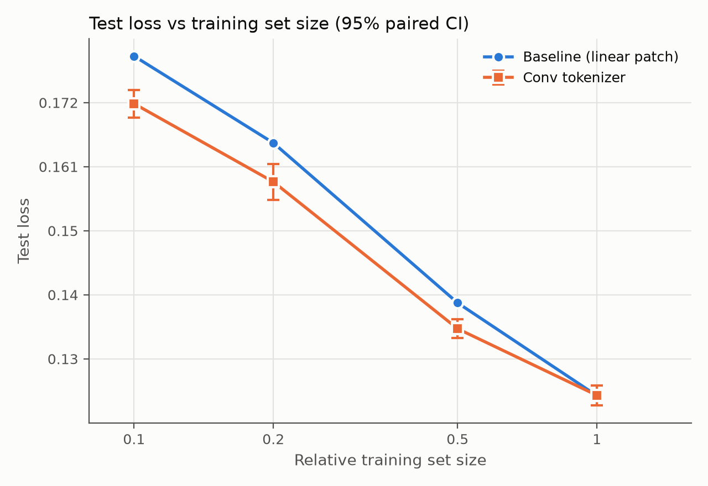
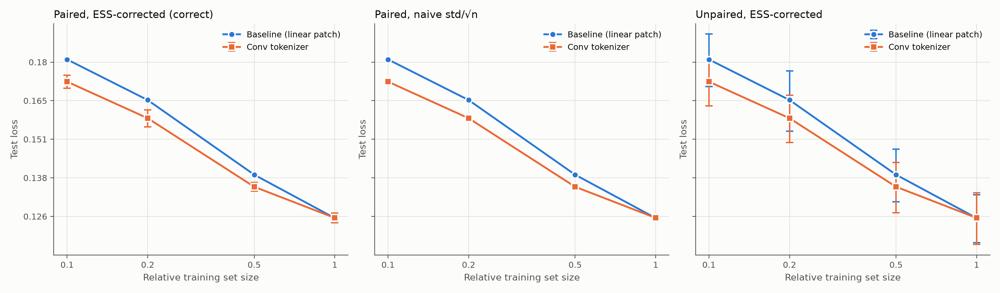

# Lab 2 Notes: Convolutional Tokenizer

## Proposed change

**What.** Replace GRT's linear patch embedding with a convolutional tokenizer
(`grt/conv_tokenizer.py::ConvSpectrumTokenizer`, selected with
`model/tokenizer=conv`). The baseline flattens each 2 (Doppler) x 4 (range)
patch of the 48-channel spectrum (2 elevation x 8 azimuth x {amplitude, sin,
cos}) and applies a single linear layer. The conv tokenizer instead runs:

1. a 3x3 convolution stem (48 -> 128 channels) + LayerNorm + GELU,
2. two ConvNeXt blocks (7x7 depthwise conv, LayerNorm, 4x inverted-bottleneck
   MLP, layer scale),
3. a strided 2x4 convolution (128 -> 512), i.e. the same patch grid as the
   baseline,

over the full-resolution 64 x 256 Doppler-range image of each frame. Doppler
uses circular padding (velocities alias, so the Doppler axis is periodic);
range uses zero padding. The token count (32 x 64 = 2048 + readout),
sinusoidal positional encoding, encoder, decoder, objective and all training
hyperparameters are unchanged.

**Why it could help.**

- *Local context per token.* A linear patch embedding sees only its own 8
  cells. Radar returns are spread across neighboring range-Doppler bins
  (sidelobes, extended targets, Doppler spread from rotating/moving parts), and
  whether a cell is a true peak or a sidelobe depends on its neighbors. With a
  receptive field of ~15 x 15 bins, each token can encode local structure
  (peak vs. sidelobe, local noise floor) before attention runs.
- *Inductive bias.* Convolutions bake in locality and translation
  equivariance, which a transformer otherwise has to learn from data. This
  should matter most at small training set sizes (p10, p20); prior work on
  ViTs ("Early Convolutions Help Transformers See Better", Xiao et al. 2021;
  hybrid ViT, Dosovitskiy et al. 2021) finds conv stems improve optimization
  stability and sample efficiency.
- *Physically-correct boundary handling* along Doppler (circular padding).
- *Cheap.* About +20% FLOPs per sample, dominated by the full-resolution
  ConvNeXt pointwise layers; the transformer is unchanged.

**Implementation.** New component + config, baseline untouched:

- `grt/conv_tokenizer.py`: `ConvSpectrumTokenizer` (same constructor surface as
  `SpectrumTokenizer`, plus `d_conv`, `depth`, `kernel_size`) and
  `DopplerRangeConvNext`, a copy of `nrdk.modules.ConvNextLayer` with mixed
  circular/zero padding. Reuses `nrdk.modules.Squeeze`, `Sinusoid`, `Readout`.
- `config/model/tokenizer/conv.yaml`.
- `tests/test_conv_tokenizer.py`: same output shape as the baseline;
  multi-frame input; remainder cropping; readout token last; receptive field
  crosses patch boundaries (and the baseline's does not); Doppler wraps and
  range does not; gradients reach every parameter; ConvNeXt block initializes
  near identity; invalid arguments are rejected.
- Sweep: `scripts/run_sweep.sh conv model/tokenizer=conv`.

## Conceptual questions

**Why not std(X)/sqrt(n)?** Test samples are consecutive radar frames from a
small number of continuous recordings, so per-sample losses are strongly
autocorrelated in time: neighboring frames see nearly the same scene and have
nearly the same loss. std/sqrt(n) assumes n independent samples. With
positively correlated samples, the actual information content is much smaller.
`nrdk.tss` estimates this as the effective sample size (ESS) from the
autocorrelation. The standard error is then std/sqrt(ESS), which is much
larger. Using sqrt(n) underestimates the standard error by a factor of
sqrt(n/ESS), giving error bars that are far too narrow and overconfident
"significant" results. See the middle panel of `scaling_ci_methods.png`, and
the ESS/n column of the table.

**Why a paired comparison?** Most of the variance in per-sample loss comes from
the sample itself: some scenes are hard for every model, others are easy.
Both models are evaluated on exactly the same frames, so their errors are
highly correlated. Differencing per sample cancels this shared variance:
Var(A - B) = Var(A) + Var(B) - 2 Cov(A, B), which is much smaller than
Var(A) + Var(B) when Cov is large. Computing each method's CI independently
ignores the covariance. The resulting intervals are dominated by
scene-difficulty variance, overlap heavily, and can hide a real, consistent
improvement (right panel of `scaling_ci_methods.png`). The paired test asks
the right question: on the same input, is model A better than model B?

## Results

Generated with `uv run analysis/scaling.py --results results_final`, where
`results_final/` symlinks the 8 runs (7 trained on ROBO `gpu:h100:2`, `conv/p10`
on GPU-shared `gpu:h100-80:2`; identical code, 2-GPU DDP, effective batch 64).
Test set: 25 traces, n = 329,895 frames. Δ is the paired per-sample difference
vs the baseline trained on the same split; the CI is the two-sided 95% interval
(±1.96 × ESS-corrected stderr, from `nrdk.tss`); Δ% is relative to the
same-split baseline.

| Split | Baseline test loss | Conv test loss | Δ (paired) | 95% CI | Δ % | ESS / n | Significant |
|---|---|---|---|---|---|---|---|
| p10 | 0.18135 | 0.17217 | −0.00917 | ±0.00256 | −5.06% ± 1.41% | 706 / 329,895 | Yes |
| p20 | 0.16495 | 0.15810 | −0.00685 | ±0.00312 | −4.16% ± 1.89% | 803 / 329,895 | Yes |
| p50 | 0.13856 | 0.13470 | −0.00386 | ±0.00138 | −2.78% ± 1.00% | 1,390 / 329,895 | Yes |
| p100 | 0.12521 | 0.12526 | +0.00005 | ±0.00137 | +0.04% ± 1.10% | 1,226 / 329,895 | No |

Training (early stopping, patience 3 validation checks at 0.25-epoch interval):

| Run | Train time | Best checkpoint |
|---|---|---|
| baseline p10 / conv p10 | 0.45 h / 0.43 h | step 4,376 / step 2,188 |
| baseline p20 / conv p20 | 0.79 h / 0.69 h | step 8,756 / step 4,378 |
| baseline p50 / conv p50 | 1.38 h / 1.47 h | step 21,892 / step 21,892 |
| baseline p100 / conv p100 | 2.77 h / 3.30 h | step 32,840 / step 43,786 |

Supporting numbers for the conceptual questions (conv vs baseline, 95% CI
half-widths):

| Split | Paired, ESS (correct) | Paired, naive std/√n | Ratio | Unpaired conv / baseline (each) |
|---|---|---|---|---|
| p10 | ±0.00256 | ±0.00012 | 21.6× | ±0.00944 / ±0.01109 |
| p20 | ±0.00312 | ±0.00015 | 20.3× | ±0.00875 / ±0.01163 |
| p50 | ±0.00138 | ±0.00009 | 15.4× | ±0.00790 / ±0.00848 |
| p100 | ±0.00137 | ±0.00008 | 16.4× | ±0.00753 / ±0.00698 |

- *Naive std/√n:* ESS is only 700–1,400 of 329,895 frames for the paired
  difference (≈ 1 effective sample per 240–470 frames), and 360–390 for each
  model's absolute loss. The naive interval is 15–22× too narrow, so the error
  bars vanish in the middle panel, and even the p100 difference (+0.04%)
  would look "significant" against such bars, i.e. a false positive.
- *Unpaired:* the per-model intervals (±0.007–0.012) are 3–7× wider than
  the paired interval of the difference, and overlap at every split (right
  panel), so the unpaired comparison cannot detect even the 5% gain at p10.
  Pairing helps twice: the per-sample std drops from 0.076–0.091 (absolute
  loss) to 0.025–0.045 (difference), because scene difficulty is shared by both
  models; and the difference is less autocorrelated (ESS 700–1,400 vs
  360–390).

## Analysis of the proposed change

**Is it significantly better?** Yes at p10, p20 and p50: the conv tokenizer
lowers test loss by 5.1%, 4.2% and 2.8%, with paired 95% CIs that exclude 0
(±1.4%, ±1.9%, ±1.0%). At p100 it is statistically indistinguishable from the
baseline (+0.04% ± 1.10%). It is not worse at any split.

**Does it scale?** The gap shrinks monotonically as the training set grows
(−5.1% → −4.2% → −2.8% → 0%). On log-log axes the conv curve is flatter: a
power-law fit between p10 and p100 gives exponents of ≈ 0.14 for conv vs ≈ 0.16
for the baseline. This is the expected signature of an inductive bias: locality
and translation equivariance substitute for data when data is scarce, but the
transformer learns equivalent local features on its own given the full training
set. Extrapolating, the curves cross around p100; there is no evidence the
change helps, or hurts, beyond the full dataset.

**Is it an improvement overall?** Yes, but a qualified one. It is a strict
improvement for data efficiency: conv at p20 (0.158) closes about a quarter
of the gap between baseline p20 (0.165) and baseline p50 (0.139), and it reached its best
validation loss in fewer steps at p10/p20 (best checkpoint at the first or
second validation check). At full data it gives no gain, at an estimated ~20% more
FLOPs per sample and a slightly longer training run (more steps before early stopping at
p100). So it is worth using when labeled radar data is limited, which for
radar is the common case. Caveats: one training seed per configuration (the
CIs capture test-set sampling noise, not seed-to-seed training variance), and
the p100 run used one ConvNeXt configuration (`d_conv=128`, `depth=2`) without
tuning.

## Evaluation and validation set sizes

**Evaluation set: right-sized in content, oversized in frames.** The 25 test
traces (n = 329,895) contain only ~360–390 effective independent samples per
model, and ~700–1,400 for paired differences. That yields a ±1.0–1.9%
resolution on paired differences: enough to detect the 3–5% gains here, but not
to resolve effects under ~1% (the p100 result cannot rule out a ±1% effect).
Because ESS is limited by the number of distinct scenes rather than frames,
the set is too small in terms of independent content (more, and more diverse,
recordings would shrink the CIs). At the same time, it is far too large in
frames for the information it carries: evaluating every frame takes ~50 GPU-min
per model, while temporal subsampling by ~10× would barely change ESS (1 effective
sample per ~250+ frames). I'd keep the set, evaluate on a strided subset of
frames, and spend the savings on additional test recordings.

**Validation set: 20% is too large.** Validation loss tracks test loss closely
(baseline p100: best val 0.1228 vs test 0.1252; baseline p10: 0.178 vs 0.181), and
the validation pass is already subsampled to 16,384 frames drawn from the
same (temporally correlated) recordings. Near the optimum, consecutive validation losses differ by
less than ~0.001 (conv p100: 0.1237, 0.1235, 0.1236, 0.1229), so checkpoint
selection is already limited by within-recording correlation, not by the
number of held-out frames, and a larger hold-out does not buy proportionally
better model selection. Meanwhile, the hold-out costs 20% of the training
data, and the scaling curves are steep at small sizes (baseline: −9% loss from
p10 to p20); at p10 the overfitting onset is sharp (val loss bottoms at the
first or second check and rises 6–8% within two more), so a modestly
noisier validation signal would still catch it. I'd reduce the hold-out to
~5–10% of each recording (or hold out a few whole recordings, which would also
make validation more representative of the recording-level test split) and
return the rest to training.
